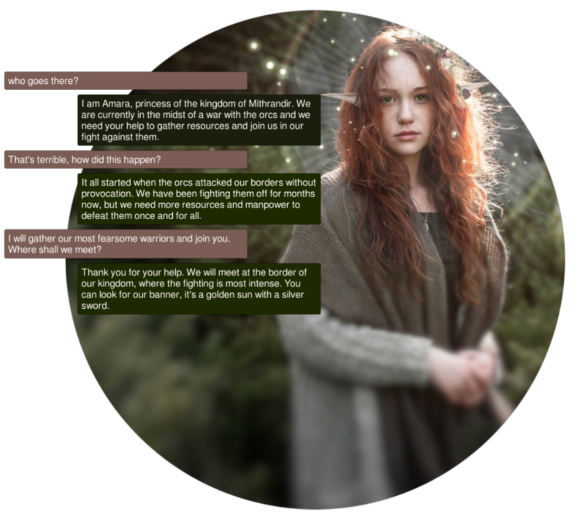
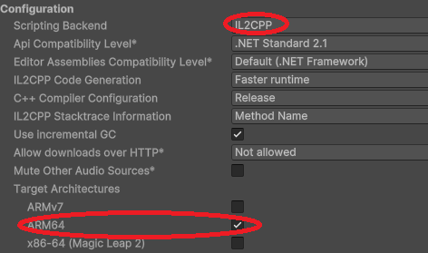
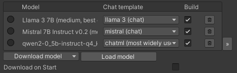
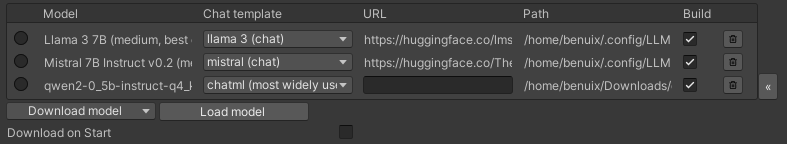
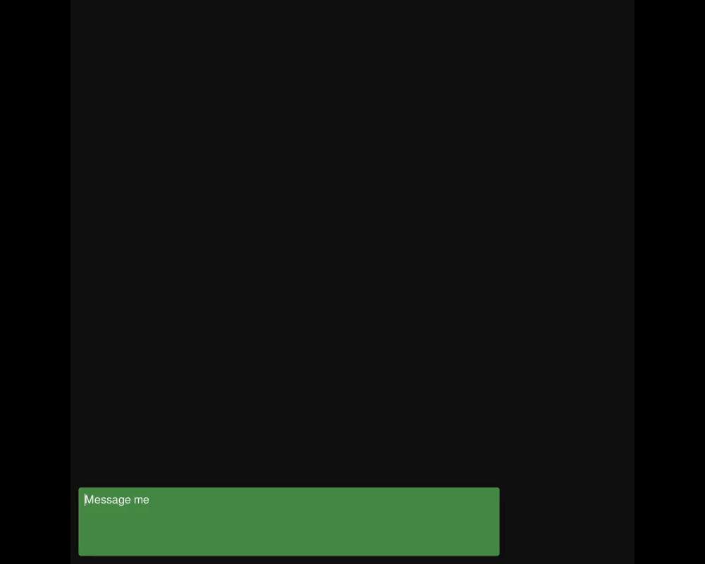
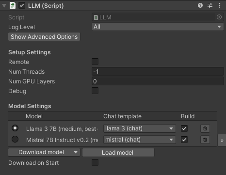
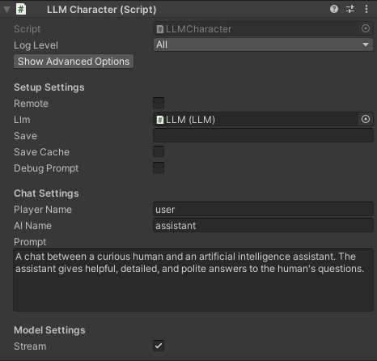

<p align="center">
<picture>
  <source media="(prefers-color-scheme: dark)" srcset=".github/logo_white.png">
  <source media="(prefers-color-scheme: light)" srcset=".github/logo.png">
  
</picture>
</p>
<h3 align="center">Morpheus Unity SDK</h3>

<h4 align="center">Creating Smart Agent NPCs & DeAi Game Dev Tools!</h4>

------

## Introduction

Decentralized AI and Smart Agents can bring transformative potential to game development, enabling persistent, autonomous NPCs that can interact meaningfully with players and manage game assets, in a trustless manner without any centralized companies collecting user data. These agents, equipped with blockchain-enabled crypto wallets, allow for dynamic interactions and economically rich game worlds where players can experience genuine asset ownership, trade, and carry items across different games. And that is why the Gnome Labs team is excited to contribute to the Morpheus ecosystem, empowering developers to integrate decentralized language models and Smart Agent NPCs into their games. Our work with the Morpheus Unity3D SDK supports this vision by making it easier for game creators to build immersive, player-driven worlds that combine advanced AI, blockchain technology, and innovative storytelling. 

------

## Objectives

- Easily integrate decentralized LLM inference into video games through the Morpheus router / Morpheus Lumerin Node system 
- Integrate Smart Agent functionality so that video games and metaverses can have Smart NPCs with access to crypto wallets 
- Explore further novel use cases of Smart Agents and decentralized AI in the Unity3D game engine

------

## Project Roadmap

### **November 2024: Technical Discovery and SDK Architecture**

**Goals**: Set up the development environment, understand the latest Morpheus router structure, and establish the Unity SDK architecture.

**Tasks**:

1. **Environment and Repository Setup**:
   - Set up local instances of the Morpheus Lumerin Node and proxy-router.
2. **Technical Discovery**:
   - Familiarize with the Morpheus Lumerin Node setup, proxy-router API, and blockchain interactions via the Arbitrum Sepolia Testnet.
   - Identify technical requirements for the blockchain interactions, including token management.
3. **SDK Architecture Design**:
   - Define the core SDK structure and integration approach for Unity (e.g., modular design to support prompt processing, blockchain interactions, and wallet functionalities).
   - Draft high-level specifications and requirements for developers to interact with decentralized LLMs, bid on model access, and manage sessions.
   - Document the initial plan for how the SDK will facilitate Smart Agent NPCs and crypto wallet interactions in Unity games.

------

### **December 2024: Core SDK Development - LLM Integration and Proxy-Router Communication**

**Goals**: Build the initial SDK components for connecting with decentralized LLMs and managing prompt routing.

**Tasks**:

1. **LLM Integration Layer**:
   - Adapt LLMUnity’s LLM connection functions to communicate with the Morpheus proxy-router instead of local LLMs.
   - Develop SDK APIs in Unity to handle prompt submission, response retrieval, and error handling.
2. **Proxy-Router Communication**:
   - Implement functions to establish sessions and send prompts via the proxy-router to Morpheus network models.
   - Ensure real-time prompt and response handling is optimized for game environments (e.g., async support for smooth game performance).
3. **Initial Testing on Testnet**:
   - Begin testing prompt submission and response handling with models on the Arbitrum Sepolia Testnet.
   - Document any performance considerations or limitations encountered and revise code as needed.

------

### **January 2025: Smart Agent NPCs and Wallet Functionality Development**

**Goals**: Develop the framework for Smart Agent non-player characters (NPCs) and integrate wallet functionalities for blockchain interactions.

**Tasks**:

1. **Smart Agent NPCs Framework Development**:
   - Create a system for NPCs to initiate prompts and interact intelligently with players, using decentralized LLM responses.
   - Implement behaviors that allow Smart Agent NPCs to store state (e.g., memory of previous interactions) and update dialogue based on player input.
2. **Crypto Wallet Integration**:
   - Develop wallet management features to allow Smart Agent NPCs or game entities to handle transactions on the Arbitrum network.
   - Implement MOR and ETH token handling, focusing initially on basic functions like balance checks and transaction initiation.
3. **Session Management**:
   - Build session handling functions to manage consumer interactions with providers, ensuring each Smart Agent NPC or player session is tracked accurately.
   - Enable session lifecycle management, allowing sessions to be easily started, paused, or ended within the SDK.

------

### **February 2025: Blockchain Bidding and Smart Contract Interactions**

**Goals**: Complete smart contract functions to enable bidding and staking and finalize Smart Agent NPC wallet capabilities.

**Tasks**:

1. **Blockchain Bidding and Staking Integration**:
   - Implement functions to handle bidding on model access, using MOR for staking and session management.
   - Develop a Unity-friendly interface for developers to manage staking and bidding logic, providing access to available models on the Morpheus network.
2. **Finalize Wallet Capabilities**:
   - Refine wallet interactions, allowing Smart Agent NPCs or players to seamlessly manage funds in their wallets.
   - Test transaction processing to ensure reliability in the game environment, handling various network conditions.
3. **Enhanced Prompt & Session Management**:
   - Finalize prompt session history and persistence for Smart Agent NPCs, allowing developers to define unique personalities and memory systems for their agents.
   - Integrate improved error handling and logging for blockchain and network issues.

------

### **March 2025: User Interface (UI) and Sample Game Integration**

**Goals**: Build a demo UI for the SDK, create a sample game showcasing SDK capabilities, and prepare initial documentation.

**Tasks**:

1. **SDK UI Components**:
   - Create reusable UI components for in-game interactions, such as dialogue boxes and response displays.
   - Implement a simple wallet management UI to showcase token balance and transaction management in a game.
2. **Sample Game Development**:
   - Build a basic Unity scene demonstrating Smart Agent NPC interactions, LLM responses, and blockchain-based actions (e.g., making purchases or performing transactions).
   - Showcase how Smart Agent NPCs can handle in-game prompts and access funds autonomously.
3. **Initial Documentation and Tutorials**:
   - Develop SDK documentation, covering installation, configuration, and API usage.
   - Write a beginner-friendly tutorial guiding developers on integrating decentralized LLMs and wallet functionality into their own games.

------

### **April 2025: Testing, Optimization, and Beta Release**

**Goals**: Complete testing, optimize performance, address any issues, and prepare the SDK for a beta release.

**Tasks**:

1. **Comprehensive Testing**:
   - Conduct extensive testing across different Unity environments and game types to ensure stability, performance, and usability.
   - Test SDK behavior under varying network conditions, ensuring the handling of slow or unreliable blockchain responses.
2. **Optimization**:
   - Refine SDK performance, reducing latency and optimizing resource use, particularly for LLM communication and wallet interactions.
   - Profile and optimize the SDK to minimize its impact on game performance.
3. **Gather Beta Feedback and Address Issues**:
   - Release the SDK in beta, gathering feedback from developers using it in real-world scenarios.
   - Address any reported issues or suggestions, and improve the SDK’s usability and reliability.

------

### **May 2025: Public Release and Community Engagement**

**Goals**: Finalize SDK, deploy it publicly, and engage with the developer community.

**Tasks**:

1. **Final Release Preparation**:
   - Finalize the SDK based on beta feedback, ensuring stability and performance.
   - Prepare SDK assets for release on platforms like GitHub and Unity Asset Store.
2. **Community and Developer Support**:
   - Establish a community space (e.g., Discord or forum) for support, discussions, and updates.
   - Host a launch event, webinars, or tutorials to introduce the SDK’s features and demonstrate its use.
3. **Developer Outreach and Ongoing Support**:
   - Engage with early adopters, continue refining the SDK based on user input, and explore potential expansions or new features.

------

*We're starting this project by building upon the existing LLMUnity project, which already provides a foundational framework for integrating language models into Unity games. LLMUnity’s existing architecture for handling prompts and responses offers an ideal starting point, and the information below outlines what comes within the LLMUnity project.*

------

LLM for Unity enables seamless integration of Large Language Models (LLMs) within the Unity engine.<br>
It allows to create intelligent characters that your players can interact with for an immersive experience.<br>
The package also features a Retrieval-Augmented Generation (RAG) system that allows to performs semantic search across your data, which can be used to enhance the character's knowledge.
LLM for Unity is built on top of the awesome [llama.cpp](https://github.com/ggerganov/llama.cpp) library.

<sub>
<a href="#at-a-glance" style="color: black">At a glance</a>&nbsp;&nbsp;•&nbsp;
<a href="#how-to-help" style=color: black>How to help</a>&nbsp;&nbsp;•&nbsp;
<a href="#games-using-llm-for-unity" style=color: black>Games using LLM for Unity</a>&nbsp;&nbsp;•&nbsp;
<a href="#setup" style=color: black>Setup</a>&nbsp;&nbsp;•&nbsp;
<a href="#how-to-use" style=color: black>How to use</a>&nbsp;&nbsp;•&nbsp;
<a href="#semantic-search-with-a-retrieval-augmented-generation-(rag)-system" style=color: black>RAG</a>&nbsp;&nbsp;•&nbsp;
<a href="#llm-model-management" style=color: black>LLM model management</a>&nbsp;&nbsp;•&nbsp;
<a href="#examples" style=color: black>Examples</a>&nbsp;&nbsp;•&nbsp;
<a href="#options" style=color: black>Options</a>&nbsp;&nbsp;•&nbsp;
<a href="#license" style=color: black>License</a>
</sub>

## At a glance
- 💻 Cross-platform! Windows, Linux, macOS and Android
- 🏠 Runs locally without internet access. No data ever leave the game!
- ⚡ Blazing fast inference on CPU and GPU (Nvidia, AMD, Apple Metal)
- 🤗 Supports all major LLM models
- 🔧 Easy to setup, call with a single line of code
- 💰 Free to use for both personal and commercial purposes

🧪 Tested on Unity: 2021 LTS, 2022 LTS, 2023<br>

------

## Setup
_Method 1: Install using the asset store_
- Open the [LLM for Unity](https://assetstore.unity.com/packages/slug/273604) asset page and click `Add to My Assets`
- Open the Package Manager in Unity: `Window > Package Manager`
- Select the `Packages: My Assets` option from the drop-down
- Select the `LLM for Unity` package, click `Download` and then `Import`

_Method 2: Install using the GitHub repo:_
- Open the Package Manager in Unity: `Window > Package Manager`
- Click the `+` button and select `Add package from git URL`
- Use the repository URL `https://github.com/undreamai/LLMUnity.git` and click `Add`

## How to use


First you will setup the LLM for your game 🏎:
- Create an empty GameObject.<br>In the GameObject Inspector click `Add Component` and select the LLM script.
- Download one of the default models with the `Download Model` button (~GBs).<br>Or load your own .gguf model with the `Load model` button (see [LLM model management](#llm-model-management)).

Then you can setup each of your characters as follows 🙋‍♀️:
- Create an empty GameObject for the character.<br>In the GameObject Inspector click `Add Component` and select the LLMCharacter script.
- Define the role of your AI in the `Prompt`. You can define the name of the AI (`AI Name`) and the player (`Player Name`).
- (Optional) Select the LLM constructed above in the `LLM` field if you have more than one LLM GameObjects.

You can also adjust the LLM and character settings according to your preference (see [Options](#options)).

In your script you can then use it as follows 🦄:
``` c#
using LLMUnity;

public class MyScript {
  public LLMCharacter llmCharacter;
  
  void HandleReply(string reply){
    // do something with the reply from the model
    Debug.Log(reply);
  }
  
  void Game(){
    // your game function
    ...
    string message = "Hello bot!";
    _ = llmCharacter.Chat(message, HandleReply);
    ...
  }
}
```
You can also specify a function to call when the model reply has been completed.<br>
This is useful if the `Stream` option is enabled for continuous output from the model (default behaviour):
``` c#
  void ReplyCompleted(){
    // do something when the reply from the model is complete
    Debug.Log("The AI replied");
  }
  
  void Game(){
    // your game function
    ...
    string message = "Hello bot!";
    _ = llmCharacter.Chat(message, HandleReply, ReplyCompleted);
    ...
  }
```

To stop the chat without waiting for its completion you can use:
``` c#
    llmCharacter.CancelRequests();
```

- Finally, in the Inspector of the GameObject of your script, select the LLMCharacter GameObject created above as the llmCharacter property.

That's all ✨!
<br><br>
You can also:

<details>
<summary>Build a mobile app on Android</summary>

To build an Android app you need to specify the `IL2CPP` scripting backend and the `ARM64` as the target architecture in the player settings.<br>
These settings can be accessed from the `Edit > Project Settings` menu within the `Player > Other Settings` section.<br>



It is also a good idea to enable the `Download on Build` option in the LLM GameObject to download the model on launch in order to keep the app size small.

</details>
<details>
<summary>Save / Load your chat history</summary>

To automatically save / load your chat history, you can specify the `Save` parameter of the LLMCharacter to the filename (or relative path) of your choice.
The file is saved in the [persistentDataPath folder of Unity](https://docs.unity3d.com/ScriptReference/Application-persistentDataPath.html).
This also saves the state of the LLM which means that the previously cached prompt does not need to be recomputed.

To manually save your chat history, you can use:
``` c#
    llmCharacter.Save("filename");
```
and to load the history:
``` c#
    llmCharacter.Load("filename");
```
where filename the filename or relative path of your choice.

</details>
<details>
<summary>Process the prompt at the beginning of your app for faster initial processing time</summary>

``` c#
  void WarmupCompleted(){
    // do something when the warmup is complete
    Debug.Log("The AI is nice and ready");
  }

  void Game(){
    // your game function
    ...
    _ = llmCharacter.Warmup(WarmupCompleted);
    ...
  }
```

</details>
<details>
<summary>Decide whether or not to add the message to the chat/prompt history</summary>

  The last argument of the `Chat` function is a boolean that specifies whether to add the message to the history (default: true):
``` c#
  void Game(){
    // your game function
    ...
    string message = "Hello bot!";
    _ = llmCharacter.Chat(message, HandleReply, ReplyCompleted, false);
    ...
  }
```

</details>
<details>
<summary>Use pure text completion</summary>

``` c#
  void Game(){
    // your game function
    ...
    string message = "The cat is away";
    _ = llmCharacter.Complete(message, HandleReply, ReplyCompleted);
    ...
  }
```

</details>
<details>
<summary>Wait for the reply before proceeding to the next lines of code</summary>

  For this you can use the `async`/`await` functionality:
``` c#
  async void Game(){
    // your game function
    ...
    string message = "Hello bot!";
    string reply = await llmCharacter.Chat(message, HandleReply, ReplyCompleted);
    Debug.Log(reply);
    ...
  }
```

</details>
<details>
<summary>Add a LLM / LLMCharacter component programmatically</summary>

``` c#
using UnityEngine;
using LLMUnity;

public class MyScript : MonoBehaviour
{
    LLM llm;
    LLMCharacter llmCharacter;

    async void Start()
    {
        // disable gameObject so that theAwake is not called immediately
        gameObject.SetActive(false);

        // Add an LLM object
        llm = gameObject.AddComponent<LLM>();
        // set the model using the filename of the model.
        // The model needs to be added to the LLM model manager (see LLM model management) by loading or downloading it.
        // Otherwise the model file can be copied directly inside the StreamingAssets folder.
        llm.SetModel("Phi-3-mini-4k-instruct-q4.gguf");
        // optional: you can also set loras in a similar fashion and set their weights (if needed)
        llm.AddLora("my-lora.gguf");
        llm.SetLoraWeight(0.5f);
        // optional: you can set the chat template of the model if it is not correctly identified
        // You can find a list of chat templates in the ChatTemplate.templates.Keys
        llm.SetTemplate("phi-3");
        // optional: set number of threads
        llm.numThreads = -1;
        // optional: enable GPU by setting the number of model layers to offload to it
        llm.numGPULayers = 10;

        // Add an LLMCharacter object
        llmCharacter = gameObject.AddComponent<LLMCharacter>();
        // set the LLM object that handles the model
        llmCharacter.llm = llm;
        // set the character prompt
        llmCharacter.SetPrompt("A chat between a curious human and an artificial intelligence assistant.");
        // set the AI and player name
        llmCharacter.AIName = "AI";
        llmCharacter.playerName = "Human";
        // optional: set streaming to false to get the complete result in one go
        // llmCharacter.stream = true;
        // optional: set a save path
        // llmCharacter.save = "AICharacter1";
        // optional: enable the save cache to avoid recomputation when loading a save file (requires ~100 MB)
        // llmCharacter.saveCache = true;
        // optional: set a grammar
        // await llmCharacter.SetGrammar("json.gbnf");

        // re-enable gameObject
        gameObject.SetActive(true);
    }
}
```

</details>
<details>
<summary>Use a remote server</summary>

You can use a remote server to carry out the processing and implement characters that interact with it.

**Create the server**<br>
To create the server:
- Create a project with a GameObject using the `LLM` script as described above
- Enable the `Remote` option of the `LLM` and optionally configure the server parameters: port, API key, SSL certificate, SSL key
- Build and run to start the server

Alternatively you can use a server binary for easier deployment:
- Run the above scene from the Editor and copy the command from the Debug messages (starting with "Server command:")
- Download the [server binaries](https://github.com/undreamai/LlamaLib/releases/download/v1.1.12/undreamai-v1.1.12-server.zip) and [DLLs](https://github.com/undreamai/LlamaLib/releases/download/v1.1.12/undreamai-v1.1.12-llamacpp-full.zip) and extract them into the same folder
- Find the architecture you are interested in from the folder above e.g. for Windows and CUDA use the `windows-cuda-cu12.2.0`.<br>You can also check the architecture that works for your system from the Debug messages (starting with "Using architecture").
- From command line change directory to the architecture folder selected and start the server by running the command copied from above.

**Create the characters**<br>
Create a second project with the game characters using the `LLMCharacter` script as described above.
Enable the `Remote` option and configure the host with the IP address (starting with "http://") and port of the server.

</details>
<details>
<summary>Compute embeddings using a LLM</summary>

The `Embeddings` function can be used to obtain the emdeddings of a phrase:
``` c#
    List<float> embeddings = await llmCharacter.Embeddings("hi, how are you?");
```

</details>

A <b>detailed documentation</b> on function level can be found [here](https://undream.ai/LLMUnity).

## Semantic search with a Retrieval-Augmented Generation (RAG) system
LLM for Unity implements a super-fast similarity search functionality with a Retrieval-Augmented Generation (RAG) system.<br>
It is based on the LLM functionality, and the Approximate Nearest Neighbors (ANN) search from the [usearch](https://github.com/unum-cloud/usearch) library.<br>
Semantic search works as follows.

**Building the data** You provide text inputs (a phrase, paragraph, document) to add to the data.<br>
Each input is split into chunks (optional) and encoded into embeddings with a LLM.

**Searching** You can then search for a query text input. <br>
The input is again encoded and the most similar text inputs or chunks in the data are retrieved.

To use semantic serch:
- create a GameObject for the LLM as described above. Download one of the provided RAG models or load your own (good options can be found at the [MTEB leaderboard](https://huggingface.co/spaces/mteb/leaderboard)).
- create an empty GameObject. In the GameObject Inspector click `Add Component` and select the `RAG` script.
- In the Search Type dropdown of the RAG select your preferred search method. `SimpleSearch` is a simple brute-force search, while`DBSearch` is a fast ANN method that should be preferred in most cases.
- In the Chunking Type dropdown of the RAG you can select a method for splitting the inputs into chunks. This is useful to have a more consistent meaning within each data part. Chunking methods for splitting according to tokens, words and sentences are provided.

Alternatively, you can create the RAG from code (where llm is your LLM):
``` c#
  RAG rag = gameObject.AddComponent<RAG>();
  rag.Init(SearchMethods.DBSearch, ChunkingMethods.SentenceSplitter, llm);
```

In your script you can then use it as follows :unicorn::
``` c#
using LLMUnity;

public class MyScript : MonoBehaviour
{
  RAG rag;

  async void Game(){
    ...
    string[] inputs = new string[]{
      "Hi! I'm a search system.",
      "the weather is nice. I like it.",
      "I'm a RAG system"
    };
    // add the inputs to the RAG
    foreach (string input in inputs) await rag.Add(input);
    // get the 2 most similar inputs and their distance (dissimilarity) to the search query
    (string[] results, float[] distances) = await rag.Search("hello!", 2);
    // to get the most similar text parts (chnuks) you can enable the returnChunks option
    rag.ReturnChunks(true);
    (results, distances) = await rag.Search("hello!", 2);
    ...
  }
}
```

You can save the RAG state (stored in the `Assets/StreamingAssets` folder):
``` c#
rag.Save("rag.zip");
```
and load it from disk:
``` c#
await rag.Load("rag.zip");
```

You can use the RAG to feed relevant data to the LLM based on a user message:
``` c#
  string message = "How is the weather?";
  (string[] similarPhrases, float[] distances) = await rag.Search(message, 3);

  string prompt = "Answer the user query based on the provided data.\n\n";
  prompt += $"User query: {message}\n\n";
  prompt += $"Data:\n";
  foreach (string similarPhrase in similarPhrases) prompt += $"\n- {similarPhrase}";

  _ = llmCharacter.Chat(prompt, HandleReply, ReplyCompleted);
```

The `RAG` sample includes an example RAG implementation as well as an example RAG-LLM integration.

That's all :sparkles:!

## LLM model management
LLM for Unity uses a model manager that allows to load or download LLMs and ship them directly in your game.<br>
The model manager can be found as part of the LLM GameObject:<br>


You can download models with the `Download model` button.<br>
LLM for Unity includes different state of the art models built-in for different model sizes, quantised with the Q4_K_M method.<br>
Alternative models can be downloaded from [HuggingFace](https://huggingface.co/models?library=gguf&sort=downloads) in the .gguf format.<br>
You can download a model locally and load it with the `Load model` button, or copy the URL in the `Download model > Custom URL` field to directly download it.<br>
If a HuggingFace model does not provide a gguf file, it can be converted to gguf with this [online converter](https://huggingface.co/spaces/ggml-org/gguf-my-repo).<br>

The chat template used for constructing the prompts is determined automatically from the model (if a relevant entry exists) or the model name. <br>
If incorrecly identified, you can select another template from the chat template dropdown.<br>
<br>
Models added in the model manager are copied to the game during the building process.<br>
You can omit a model from being built in by deselecting the "Build" checkbox.<br>
To remove the model (but not delete it from disk) you can click the bin button.<br>
The the path and URL (if downloaded) of each added model is diplayed in the expanded view of the model manager access with the `>>` button:<br>


You can create lighter builds by selecting the `Download on Build` option.<br>
Using this option the models will be downloaded the first time the game starts instead of copied in the build.<br>
If you have loaded a model locally you need to set its URL through the expanded view, otherwise it will be copied in the build.<br>

## Examples
The [Samples~](Samples~) folder contains several examples of interaction 🤖:
- [SimpleInteraction](Samples~/SimpleInteraction): Demonstrates a simple interaction with an AI character
- [MultipleCharacters](Samples~/MultipleCharacters): Demonstrates a simple interaction using multiple AI characters
- [RAG](Samples~/RAG): RAG sample. Includes an example using the RAG to feed information to a LLM
- [ChatBot](Samples~/ChatBot): Demonstrates interaction between a player and a AI with a UI similar to a messaging app (see image below)
- [KnowledgeBaseGame](Samples~/KnowledgeBaseGame): Simple detective game using a knowledge base to provide information to the LLM based on [google/mysteryofthreebots](https://github.com/google/mysteryofthreebots)
- [AndroidDemo](Samples~/AndroidDemo): Example Android app with an initial screen with model download progress
  



To install a sample:
- Open the Package Manager: `Window > Package Manager`
- Select the `LLM for Unity` Package. From the `Samples` Tab, click `Import` next to the sample you want to install.

The samples can be run with the `Scene.unity` scene they contain inside their folder.<br>
In the scene, select the `LLM` GameObject and click the `Download Model` button to download a default model or `Load model` to load your own model (see [LLM model management](#llm-model-management)).<br>
Save the scene, run and enjoy!

## Options

### LLM Settings

- `Show/Hide Advanced Options` Toggle to show/hide advanced options from below
- `Log Level` select how verbose the log messages are
- `Use extras` select to install and allow the use of extra features (flash attention and IQ quants)

#### 💻 Setup Settings

<div>

</div>

- `Remote` select to provide remote access to the LLM
- `Port` port to run the LLM server (if `Remote` is set)
- `Num Threads` number of threads to use (default: -1 = all)
- `Num GPU Layers` number of model layers to offload to the GPU.
If set to 0 the GPU is not used. Use a large number i.e. >30 to utilise the GPU as much as possible.
Note that higher values of context size will use more VRAM.
If the user's GPU is not supported, the LLM will fall back to the CPU
- `Debug` select to log the output of the model in the Unity Editor
- <details><summary>Advanced options</summary>

  - <details><summary><code>Parallel Prompts</code> number of prompts / slots that can happen in parallel (default: -1 = number of LLMCharacter objects). Note that the context size is divided among the slots.</summary> If you want to retain as much context for the LLM and don't need all the characters present at the same time, you can set this number and specify the slot for each LLMCharacter object.
  e.g. Setting `Parallel Prompts` to 1 and slot 0 for all LLMCharacter objects will use the full context, but the entire prompt will need to be computed (no caching) whenever a LLMCharacter object is used for chat. </details>
  - `Dont Destroy On Load` select to not destroy the LLM GameObject when loading a new Scene

</details>

### Server Security Settings

- `API key` API key to use to allow access to requests from LLMCharacter objects (if `Remote` is set)
- <details><summary>Advanced options</summary>

  - `Load SSL certificate` allows to load a SSL certificate for end-to-end encryption of requests (if `Remote` is set). Requires SSL key as well.
  - `Load SSL key` allows to load a SSL key for end-to-end encryption of requests (if `Remote` is set). Requires SSL certificate as well.
  - `SSL certificate path` the SSL certificate used for end-to-end encryption of requests (if `Remote` is set).
  - `SSL key path` the SSL key used for end-to-end encryption of requests (if `Remote` is set).

</details>

#### 🤗 Model Settings
- `Download model` click to download one of the default models
- `Load model` click to load your own model in .gguf format
- `Download on Start` enable to downloaded the LLM models the first time the game starts. Alternatively the LLM models wil be copied directly in the build
- <details><summary><code>Context Size</code> size of the prompt context (0 = context size of the model)</summary> This is the number of tokens the model can take as input when generating responses. Higher values use more RAM or VRAM (if using GPU). </details>

- <details><summary>Advanced options</summary>

  - `Download lora` click to download a LoRA model in .gguf format
  - `Load lora` click to load a LoRA model in .gguf format
  - `Batch Size` batch size for prompt processing (default: 512)
  - `Model` the path of the model being used (relative to the Assets/StreamingAssets folder)
  - `Chat Template` the chat template being used for the LLM
  - `Lora` the path of the LoRAs being used (relative to the Assets/StreamingAssets folder)
  - `Lora Weights` the weights of the LoRAs being used
  - `Flash Attention` click to use flash attention in the model (if `Use extras` is enabled)

</details>

#### 🗨️ Chat Settings
- <details><summary>Advanced options</summary>

- `Base Prompt` a common base prompt to use across all LLMCharacter objects using the LLM

</details>

### LLMCharacter Settings

- `Show/Hide Advanced Options` Toggle to show/hide advanced options from below
- `Log Level` select how verbose the log messages are
- `Use extras` select to install and allow the use of extra features (flash attention and IQ quants)

#### 💻 Setup Settings
<div>

</div>

- `Remote` whether the LLM used is remote or local
- `LLM` the LLM GameObject (if `Remote` is not set)
- `Hort` ip of the LLM server (if `Remote` is set)
- `Port` port of the LLM server (if `Remote` is set)
- `Num Retries` number of HTTP request retries from the LLM server (if `Remote` is set)
- `API key` API key of the LLM server (if `Remote` is set)
- <details><summary><code>Save</code> save filename or relative path</summary> If set, the chat history and LLM state (if save cache is enabled) is automatically saved to file specified. <br> The chat history is saved with a json suffix and the LLM state with a cache suffix. <br> Both files are saved in the [persistentDataPath folder of Unity](https://docs.unity3d.com/ScriptReference/Application-persistentDataPath.html).</details>
- `Save Cache` select to save the LLM state along with the chat history. The LLM state is typically around 100MB+.
- `Debug Prompt` select to log the constructed prompts in the Unity Editor

#### 🗨️ Chat Settings
- `Player Name` the name of the player
- `AI Name` the name of the AI
- `Prompt` description of the AI role

#### 🤗 Model Settings
- `Stream` select to receive the reply from the model as it is produced (recommended!).<br>
If it is not selected, the full reply from the model is received in one go
- <details><summary><code>Num Predict</code> maximum number of tokens to predict (default: 256, -1 = infinity, -2 = until context filled)</summary>This is the maximum amount of tokens the model will maximum predict. When N tokens are reached the model will stop generating. This means words / sentences might not get finished if this is too low. </details>

- <details><summary>Advanced options</summary>

  - `Load grammar` click to load a grammar in .gbnf format
  - `Grammar` the path of the grammar being used (relative to the Assets/StreamingAssets folder)
  - <details><summary><code>Cache Prompt</code> save the ongoing prompt from the chat (default: true)</summary> Saves the prompt while it is being created by the chat to avoid reprocessing the entire prompt every time</details>
  - `Slot` slot of the server to use for computation. Value can be set from 0 to `Parallel Prompts`-1 (default: -1 = new slot for each character)
  - `Seed` seed for reproducibility. For random results every time use -1
  - <details><summary><code>Temperature</code> LLM temperature, lower values give more deterministic answers (default: 0.2)</summary>The temperature setting adjusts how random the generated responses are. Turning it up makes the generated choices more varied and unpredictable. Turning it down makes the generated responses more predictable and focused on the most likely options.</details>
  - <details><summary><code>Top K</code> top-k sampling (default: 40, 0 = disabled)</summary>The top k value controls the top k most probable tokens at each step of generation. This value can help fine tune the output and make this adhere to specific patterns or constraints.</details>
  - <details><summary><code>Top P</code> top-p sampling (default: 0.9, 1.0 = disabled)</summary>The top p value controls the cumulative probability of generated tokens. The model will generate tokens until this theshold (p) is reached. By lowering this value you can shorten output & encourage / discourage more diverse outputs.</details>
  - <details><summary><code>Min P</code> minimum probability for a token to be used (default: 0.05)</summary> The probability is defined relative to the probability of the most likely token.</details>
  - <details><summary><code>Repeat Penalty</code> control the repetition of token sequences in the generated text (default: 1.1)</summary>The penalty is applied to repeated tokens.</details>
  - <details><summary><code>Presence Penalty</code> repeated token presence penalty (default: 0.0, 0.0 = disabled)</summary> Positive values penalize new tokens based on whether they appear in the text so far, increasing the model's likelihood to talk about new topics.</details>
  - <details><summary><code>Frequency Penalty</code> repeated token frequency penalty (default: 0.0, 0.0 = disabled)</summary> Positive values penalize new tokens based on their existing frequency in the text so far, decreasing the model's likelihood to repeat the same line verbatim.</details>
  - `Tfs_z`: enable tail free sampling with parameter z (default: 1.0, 1.0 = disabled).
  - `Typical P`: enable locally typical sampling with parameter p (default: 1.0, 1.0 = disabled).
  - `Repeat Last N`: last N tokens to consider for penalizing repetition (default: 64, 0 = disabled, -1 = ctx-size).
  - `Penalize Nl`: penalize newline tokens when applying the repeat penalty (default: true).
  - `Penalty Prompt`: prompt for the purpose of the penalty evaluation. Can be either `null`, a string or an array of numbers representing tokens (default: `null` = use original `prompt`).
  - `Mirostat`: enable Mirostat sampling, controlling perplexity during text generation (default: 0, 0 = disabled, 1 = Mirostat, 2 = Mirostat 2.0).
  - `Mirostat Tau`: set the Mirostat target entropy, parameter tau (default: 5.0).
  - `Mirostat Eta`: set the Mirostat learning rate, parameter eta (default: 0.1).
  - `N Probs`: if greater than 0, the response also contains the probabilities of top N tokens for each generated token (default: 0)
  - `Ignore Eos`: enable to ignore end of stream tokens and continue generating (default: false).

</details>
